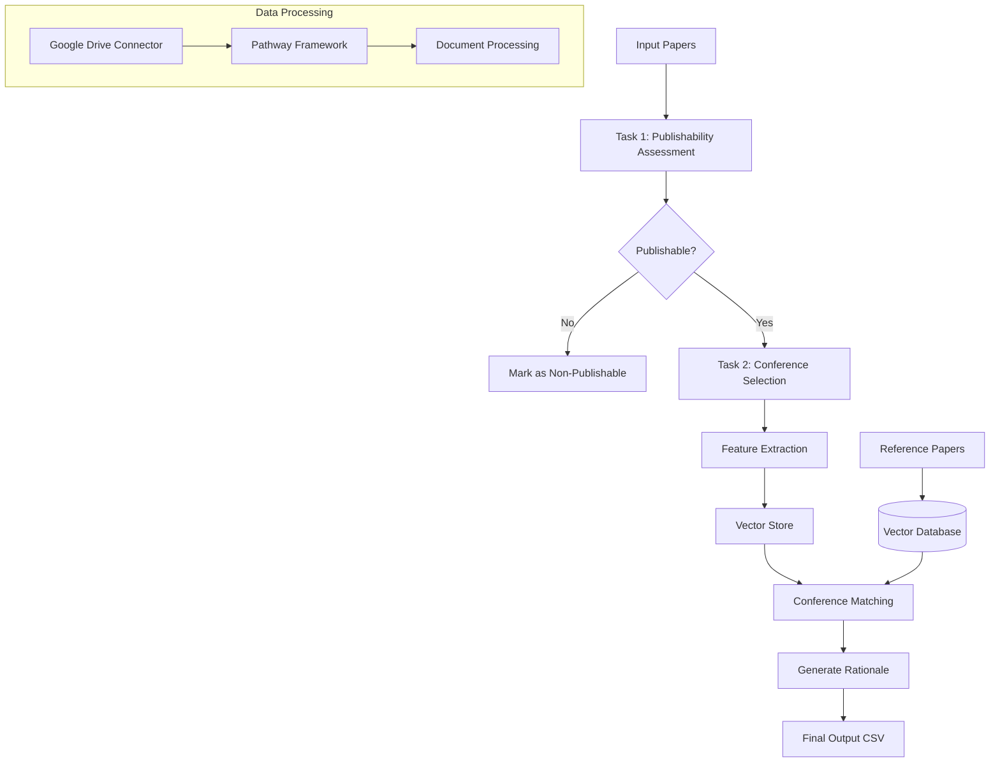

```mermaid
flowchart TD
    A[Input Papers] --> B[Task 1: Publishability Assessment]
    B --> C{Publishable?}
    C -->|No| D[Mark as Non-Publishable]
    C -->|Yes| E[Task 2: Conference Selection]
    E --> F[Feature Extraction]
    F --> G[Vector Store]
    G --> H[Conference Matching]
    H --> I[Generate Rationale]
    I --> J[Final Output CSV]
    
    K[Reference Papers] --> L[(Vector Database)]
    L --> H
    
    subgraph "Data Processing"
    M[Google Drive Connector] --> N[Pathway Framework]
    N --> O[Document Processing]
    end
```
